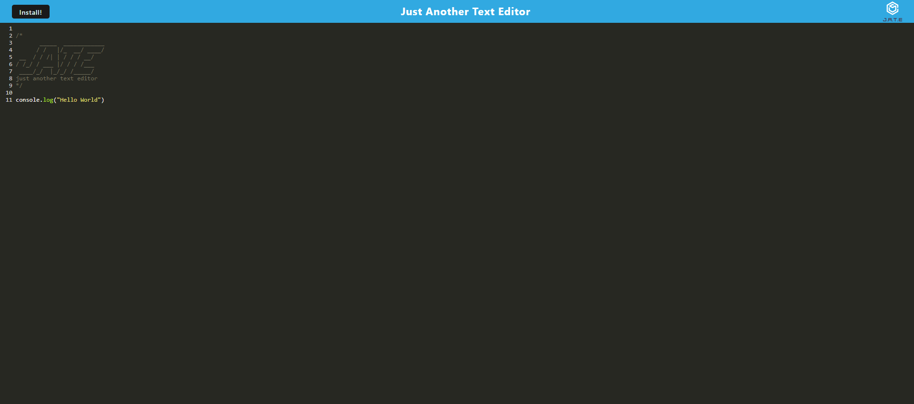
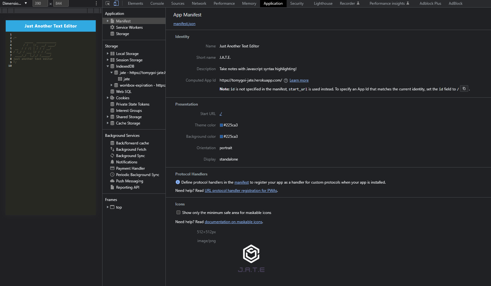
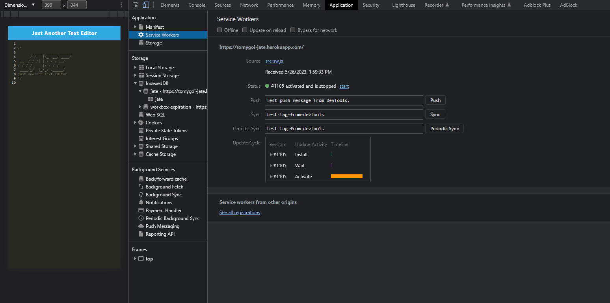
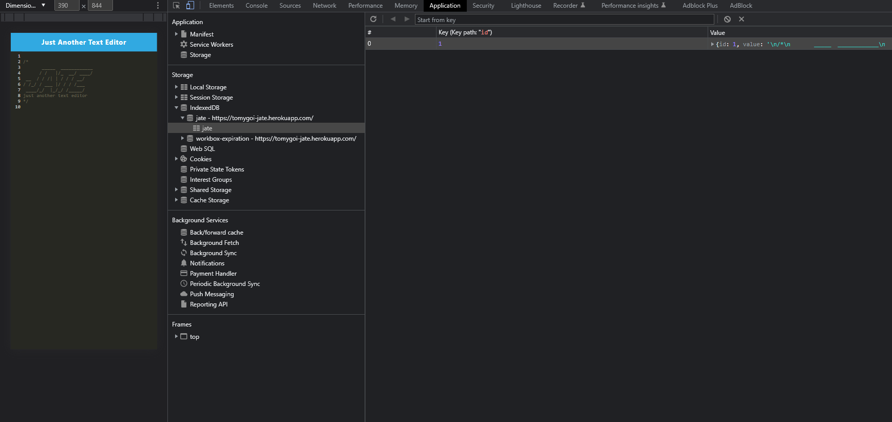

# textEditor

## Description 
This is a PWA containing a simple text editor that highlights javascript syntax 
## Table of Contents 
- [Installation](#Installation)
- [Usage](#Usage)
- [Screenshots](#Screenshots)
- [Frameworks](#Frameworks)
- [Dependencies](#Dependencies)
## Installation
- Clone the repository locally
- Open terminal and cd to the root directory of the repository
- Run `npm install` to install all the required packages
- Run `npm run install` to install client and server packages 
## Usage 
- Run `npm start`
- View deployed application [here](https://tomygoi-jate.herokuapp.com/)
## Frameworks
Node JS 
## Dependencies
Express and if-env
## Screenshots 

## Credit

